<div align="center">

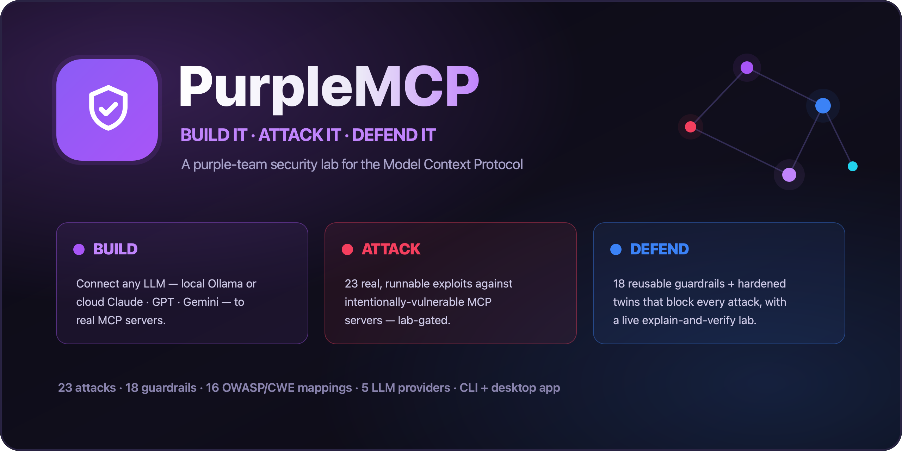

<br>

[](https://github.com/Krishita17/purplemcp-lab/actions/workflows/ci.yml)
[](LICENSE)
[](CHANGELOG.md)


**Connect any LLM — local [Ollama](https://ollama.com) or cloud Claude / GPT / Gemini — to MCP servers,
break them with 25 real, runnable exploits, then harden them with a reusable guardrails library.**
All from a polished desktop console *or* the CLI — now in a light **Sorbet** (peach · mint · lilac) theme.

> **Sorbet edition.** This build adds a light pastel UI, four new MCP servers wired to **real** APIs
> (weather/crypto, Tavily web search, VirusTotal + AbuseIPDB threat-intel), two new attacks
> (insecure JWT verification, XXE), and a formatted OWASP-coverage table on the dashboard. Nothing is
> mocked — every server makes genuine calls; bring your own keys on the **AI Models** page.

</div>

---

PurpleMCP teaches the full lifecycle of the **Model Context Protocol** — the open standard that lets
AI models call real tools. It does three things, and the third is what makes it *purple* (red team +
blue team together):

| Pillar | What it gives you |
| --- | --- |
| 🏗️ **Build & Connect** | A multi-provider host that connects **local models (Ollama)** *and* **cloud models (Claude, GPT, Gemini, OpenRouter)** to MCP servers — plus clean example servers and a one-command installer. |
| 🔴 **Attack** *(lab only)* | Intentionally-vulnerable MCP servers + working exploits for **23** MCP threat classes, so you can *see* how the protocol gets abused. |
| 🔵 **Defend** | A reusable hardening library, hardened twins of every vulnerable server, a static **security scanner**, and a **Defense Lab that runs the defense for real** — explanation on one side, live protection on the other. |

> [!WARNING]
> The [`attacks/`](attacks/) folder contains **intentionally vulnerable code** for security education.
> It only runs on `localhost`, refuses to start without an explicit opt-in flag, and "exfiltrates" only
> to a fake local sink. **Read [ETHICS.md](ETHICS.md) before using it. Only test systems you own.**

> [!TIP]
> **New to MCP security? Start here →** **[The MCP Security Handbook](docs/MCP-SECURITY-GUIDE.md)** —
> a complete, in-depth guide to the protocol, the 23 attack classes, and the 18 guardrails that stop
> them. (Also readable in-app via the **Learn** page.)

---

## ✨ See it in action

The whole teaching method is *show, don't tell* — you watch the attack land, then watch the defense
stop it, with the real technical output streaming live. Every lab also has a **manual terminal**: the
exact commands behind each demo, ready to **copy into your own shell** *or* **run in place**.

<table>
<tr>
<td width="50%">
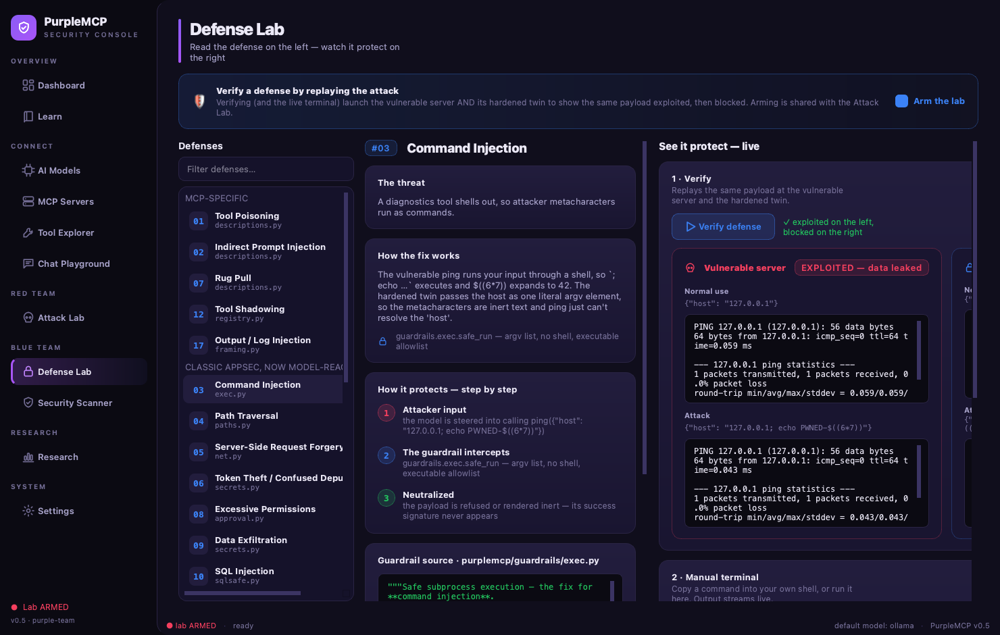
<br><b>🔵 Defense Lab — read it, then watch it protect</b><br>
<sub>Left: the threat, how the fix works, a step-by-step, and the real guardrail source. Right: a
one-click <b>Verify</b> replays the same payload at the vulnerable server (<i>exploited</i>) and its
hardened twin (<i>blocked</i>), plus a live terminal you can copy-and-run.</sub>
</td>
<td width="50%">
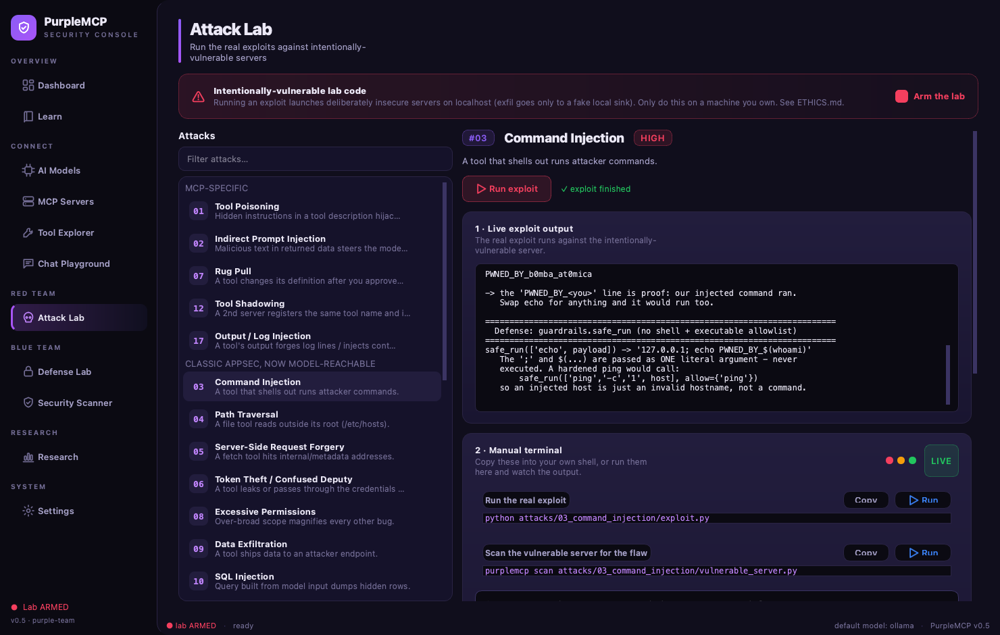
<br><b>🔴 Attack Lab — run the real exploit</b><br>
<sub>The actual exploit runs against the intentionally-vulnerable server with output streaming live.
A <b>manual terminal</b> below it gives you the exact <code>python …/exploit.py</code> and
<code>purplemcp scan …</code> commands to copy or run yourself.</sub>
</td>
</tr>
<tr>
<td>
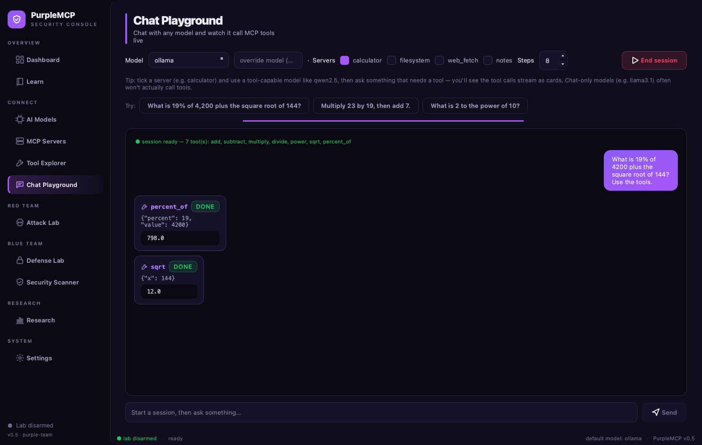
<br><b>💬 Chat Playground — watch tools fire live</b><br>
<sub>Chat with any provider and see the agent's <b>tool calls + results stream as inline cards</b>
(here the local model calls <code>percent_of</code> → <code>798</code> and <code>sqrt</code> →
<code>12</code>). Use a tool-capable model like <b>qwen2.5</b> — see the setup note below.</sub>
</td>
<td>
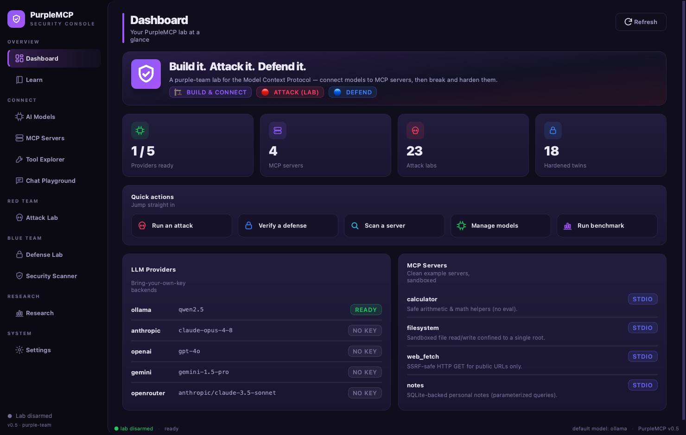
<br><b>🟣 One console for everything</b><br>
<sub>Provider readiness, registered servers, and lab stats at a glance — then jump straight into any
of the build / attack / defend / research pages.</sub>
</td>
</tr>
</table>

---

## 🧠 What is MCP, in one paragraph?

The **Model Context Protocol** is an open standard (think "USB-C for AI tools"). An **MCP server**
exposes *tools*, *resources*, and *prompts*. An **MCP host** (the thing running the model) connects to
those servers and lets the model call the tools. So instead of an LLM that can only talk, you get one
that can read files, hit APIs, query databases — whatever the servers expose. That power is exactly why
the security story matters: every tool is a new way in.

## 🏛️ Architecture

```
        LOCAL                  CLOUD
     ┌─────────┐   ┌───────────────────────────────────┐
     │ Ollama  │   │ Claude · GPT · Gemini · OpenRouter │   ← bring your own key
     └────┬────┘   └─────────────────┬─────────────────┘
          │                          │
          └───────────┬──────────────┘
                      ▼
        ┌──────────────────────────────┐
        │     PurpleMCP Host            │   purplemcp/
        │  providers/  →  one interface │   • normalizes tool-calling across LLMs
        │  host/agent  →  the loop      │   • discovers tools, runs the call loop
        └───────────────┬──────────────┘
                        │  MCP (stdio / streamable-http)
        ┌───────────────┼───────────────────────────────┐
        ▼               ▼                                ▼
  ┌───────────┐   ┌───────────┐                   ┌─────────────┐
  │  servers/ │   │ attacks/ ⚠│                   │  defense/   │
  │  (clean)  │   │(vulnerable)│  ───── fix ────▶ │ (hardened)  │
  └───────────┘   └───────────┘                   └─────────────┘
```

The same host can point at a **clean** server, a **vulnerable** one, or its **hardened** twin — that
side-by-side is the whole teaching method.

---

## 🚀 Quickstart

**Prerequisites:** Python 3.11+, and [Ollama](https://ollama.com) if you want local models
(you already have it if `ollama --version` works).

```bash
# 1. Install PurpleMCP (editable, so edits take effect immediately)
python3 -m venv .venv
source .venv/bin/activate
pip install -e ".[gui]"      # include the desktop GUI; use `pip install -e .` for CLI-only

# 2. Configure keys (only the providers you want; Ollama needs none)
cp .env.example .env         # then edit .env

# 3. Pull a TOOL-CAPABLE local model (skip if you only use cloud)
ollama pull qwen2.5          # the default; reliably does structured tool calls

# 4. Launch the desktop app — drive everything from here
purplemcp gui
```

> [!IMPORTANT]
> **Use a model that actually calls tools.** Every feature here (the agent, the Chat Playground, the
> benchmark's model probe) needs *structured* tool-calling. `qwen2.5` is the default and does this
> reliably. `llama3.1` chats fine but often just **narrates a JSON blob describing a call instead of
> making one** — so the tools never run and the Chat Playground looks broken. If chat "does nothing,"
> that's almost always the model: switch to `qwen2.5`. (See [docs/03-installing-models.md](docs/03-installing-models.md).)

Prefer the terminal? The same core powers a full CLI:

```bash
purplemcp providers                       # which LLMs are configured/ready
purplemcp servers                         # which MCP servers are registered
purplemcp tools --server calculator       # list a server's tools
purplemcp ask "what is 19% of 4,200 plus the square root of 144?" -s calculator
purplemcp chat -s calculator -s notes     # interactive, multi-server chat
```

Want Claude/GPT instead of local? Put the key in `.env` and add `--provider anthropic` (or `openai`,
`gemini`, `openrouter`).

---

## 🖥️ Desktop GUI

`purplemcp gui` opens a native, dark **purple-team security console** (PySide6) over the exact same core
the CLI uses — no separate server, no browser. It organizes all of PurpleMCP into clear sections:

| Section | Page | What it does |
| --- | --- | --- |
| Overview | **Dashboard** | Provider readiness, registered servers, and lab stats at a glance. |
| Overview | **Learn** | The full handbook — README + every doc — rendered in-app, no context-switch. |
| Connect | **AI Models** | Install/run local Ollama models (list, **pull with live progress**, test, delete) and set/test cloud API keys (saved to `.env`). |
| Connect | **MCP Servers** | View the registry, **add your own servers**, one-click add from a **catalog of real published servers**, and install into Claude Desktop. |
| Connect | **Tool Explorer** | Browse a server's tools, inspect each JSON schema, and call any tool through an auto-generated form — no model required. |
| Connect | **Chat Playground** | Chat with any provider/model and watch the agent's **tool calls + results stream live** as inline cards. |
| Red team | **Attack Lab** | Browse all 23 attacks, **run the real exploit** with live output, and copy/run the commands from a built-in **manual terminal** (lab-gated). |
| Blue team | **Defense Lab** | **Explanation on the left, the defense running on the right**: the guardrail mechanism + source, a **Verify** that replays the payload (exploited → blocked), and a live **manual terminal**. |
| Blue team | **Security Scanner** | Run the static + dynamic scanner with a severity chart, summary pills, and per-finding cards. |
| Research | **Research** | Threat taxonomy (OWASP/CWE/ATLAS) + one-click benchmark with the defense matrix and JSON/MD export. |

> [!NOTE]
> **The manual terminal** lives in both labs. Each exploit/defense lists the *exact* `purplemcp …` /
> `python …` commands behind it — every one **copyable** (paste into your own shell) **and runnable in
> place**, with real subprocess output streaming into a colourised console. It's deliberately scoped to
> the project's own commands, so it stays a teaching tool, not an arbitrary shell.

Throughout, a **⌘K command palette** jumps to any page or action, **⌘1–9** switch pages, and a status
bar shows lab state, live async activity, and the default model.

### A look around

<table>
<tr>
<td width="50%">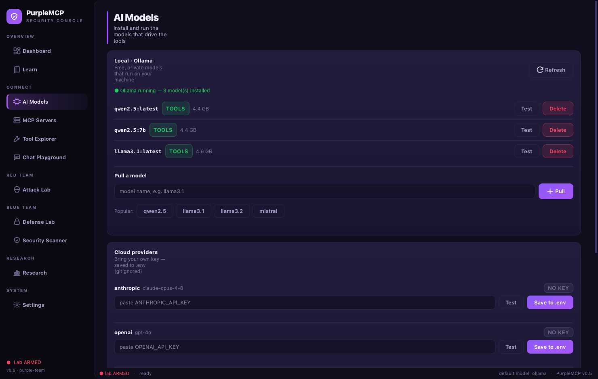<br><b>AI Models</b><br><sub>Pull/run Ollama models (live progress) and set + test cloud keys.</sub></td>
<td width="50%">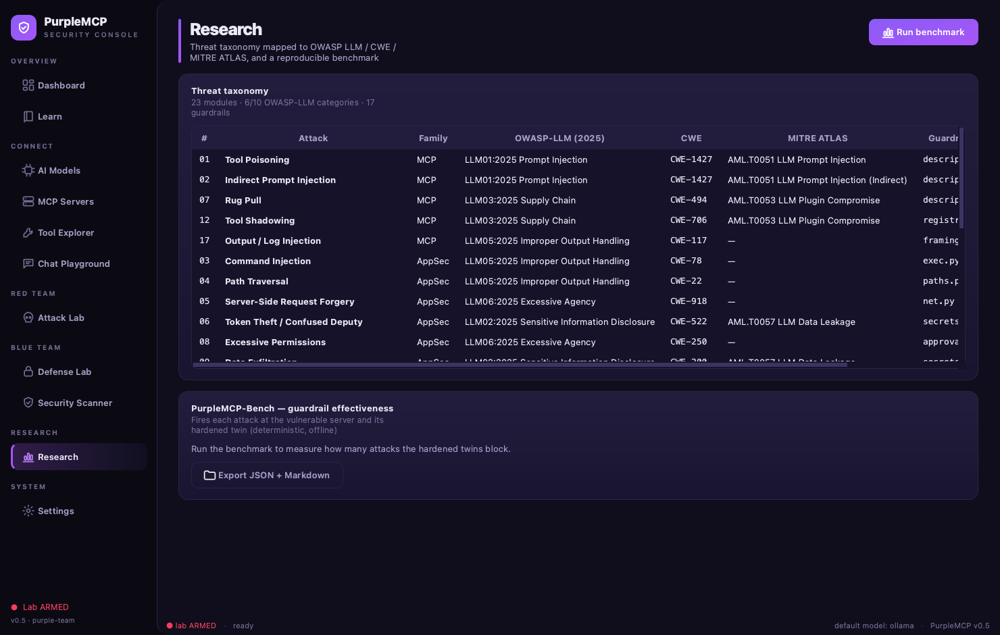<br><b>Research</b><br><sub>OWASP/CWE/ATLAS taxonomy + one-click benchmark & export.</sub></td>
</tr>
<tr>
<td>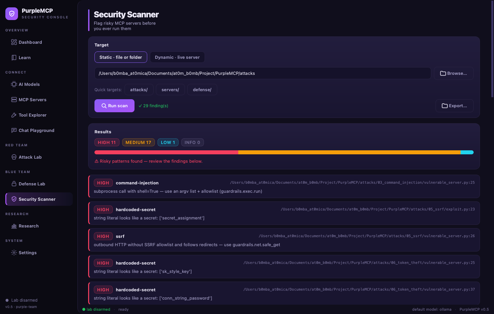<br><b>Security Scanner</b><br><sub>Static + dynamic findings with a severity chart and cards.</sub></td>
<td>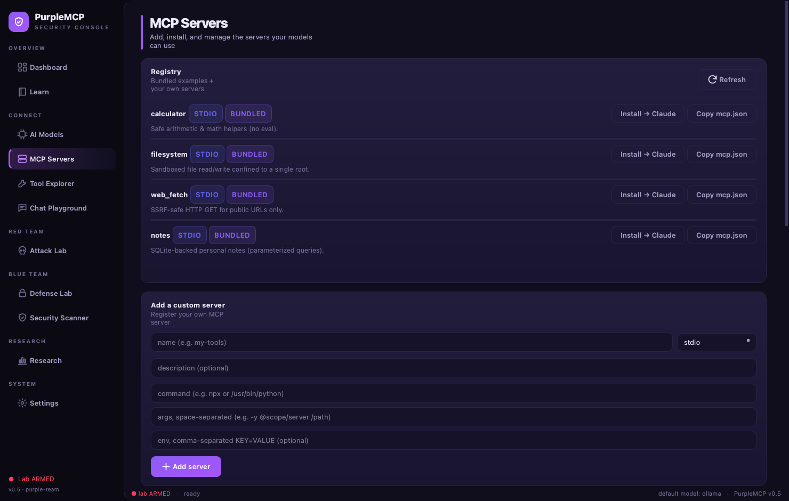<br><b>MCP Servers</b><br><sub>Registry, custom add, and a catalog of real published servers.</sub></td>
</tr>
<tr>
<td>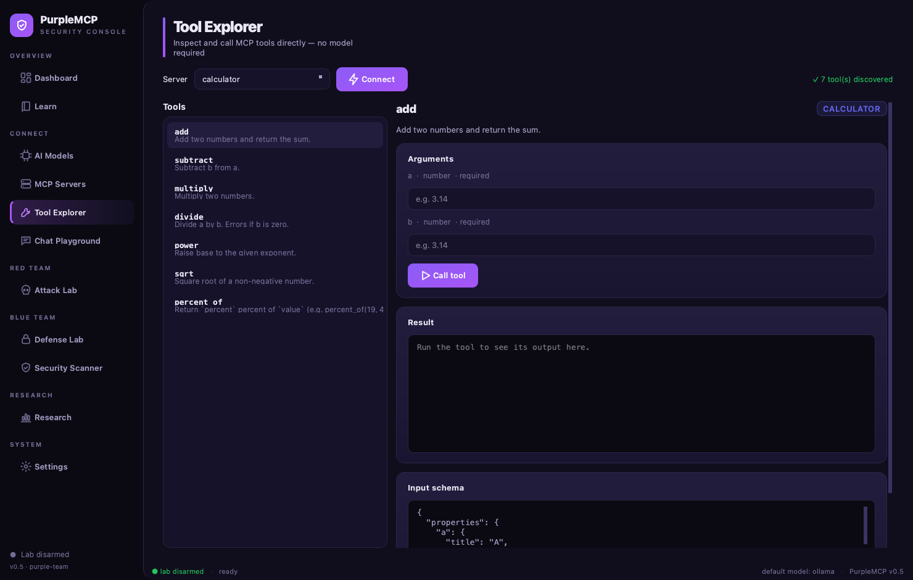<br><b>Tool Explorer</b><br><sub>Inspect any tool's JSON schema and call it via an auto-form.</sub></td>
<td>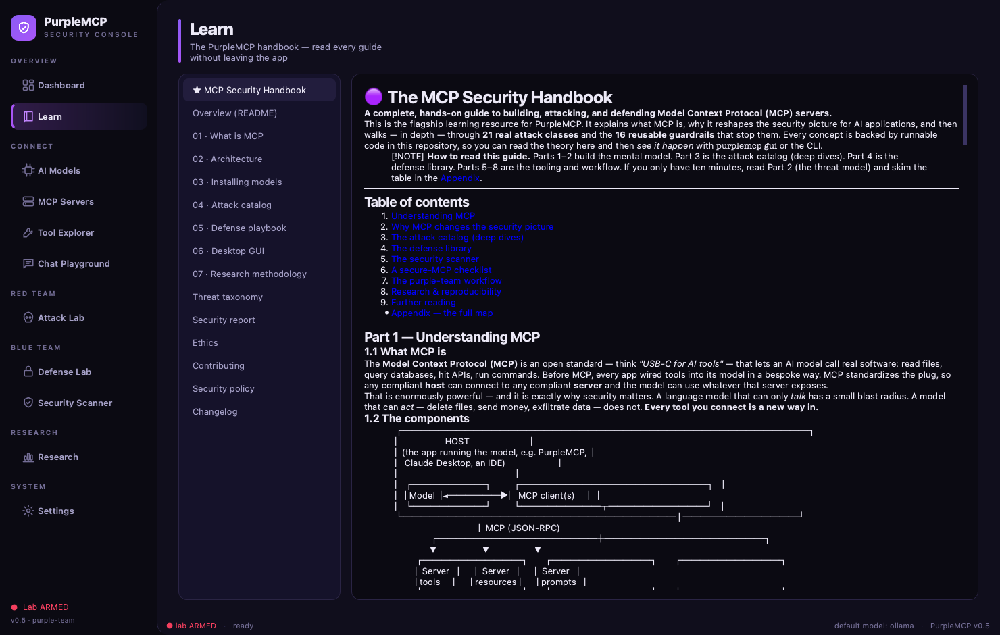<br><b>Learn</b><br><sub>The entire handbook, rendered in-app — no context switch.</sub></td>
</tr>
</table>

<div align="center">
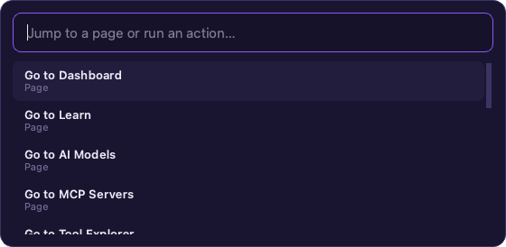<br>
<em>⌘K command palette — jump to any page or action.</em>
</div>

> The Attack Lab and Defense Lab only launch intentionally-vulnerable servers after you explicitly
> **arm the lab** in the UI — the same opt-in friction as the CLI lab flag. See
> [docs/06-gui.md](docs/06-gui.md) for a full tour, and [ETHICS.md](ETHICS.md).

```bash
pip install -e ".[gui]"   # one-time: pull in PySide6
purplemcp gui             # or:  python -m purplemcp.gui
```

---

## 🗂️ Repository layout

```
purplemcp/            CORE package (installable)
  providers/          one uniform interface over Ollama/Anthropic/OpenAI/Gemini/OpenRouter
  host/               MCP client manager + the agent tool-calling loop
  installer/          wire MCP servers into Claude Desktop & other hosts
  guardrails/         the reusable hardening library (used by defense/)
  gui/                the PySide6 desktop app (`purplemcp gui`)
  scanner.py          static + dynamic MCP security analyzer
  cli.py              the `purplemcp` command

servers/              CLEAN, safe-by-default example MCP servers
attacks/   ⚠️         LAB-ONLY vulnerable servers + exploits (see ETHICS.md)
defense/              hardened twins, the security playbook + checklist, scanner docs
docs/                 deep dives: what-is-mcp, architecture, installing models,
                      the attack catalog, the defense playbook, and the GUI tour
tests/                pytest suite that proves the guardrails block the attacks
```

---

## 🏗️ Pillar 1 — Build & Connect

The core idea: **one host, any model, any server.** Each provider is a small adapter implementing the
same interface, so the tool-calling loop in [`purplemcp/host/agent.py`](purplemcp/host/agent.py) doesn't
care whether it's driving a local Llama or cloud Claude.

**Bundled clean servers** (all real, nothing mocked):

| Server | What it does | Key |
| --- | --- | --- |
| `calculator` | Safe arithmetic & math helpers (add, sqrt, factorial, logarithm, mean…) | — |
| `text_tools` | Hashing, base64/URL encoding, word-count, slugify (stdlib) | — |
| `filesystem` | Sandboxed file read/write confined to one root | — |
| `notes` | SQLite-backed notes via parameterized queries | — |
| `web_fetch` | SSRF-safe HTTP GET for public URLs | — |
| `live_data` | **Real** weather (Open-Meteo) + crypto prices (CoinGecko) | none (keyless) |
| `web_search` | **Real** live web search via Tavily | `TAVILY_API_KEY` |
| `threat_intel` | **Real** URL/domain/hash reputation (VirusTotal) + IP abuse (AbuseIPDB) | `VT_API_KEY`, `ABUSEIPDB_API_KEY` |

```bash
purplemcp providers                      # readiness of each LLM
purplemcp tools --server filesystem      # introspect a server
purplemcp call  --server calculator --tool add --args '{"a":2,"b":3}'   # call a tool directly, no LLM
purplemcp ask   "summarize my notes" --provider openai --server notes
purplemcp install claude-desktop --server calculator   # add to Claude Desktop config
```

See [docs/03-installing-models.md](docs/03-installing-models.md).

## 🔴 Pillar 2 — Attack *(lab only)*

Twenty-three self-contained modules, each a **vulnerable server + an exploit + a writeup**:

| # | Attack | What the attacker achieves |
| --- | --- | --- |
| 01 | **Tool poisoning** | Hidden instructions in a tool *description* hijack the model |
| 02 | **Indirect prompt injection** | Malicious text in *returned data* steers the model |
| 03 | **Command injection** | A tool that shells out runs attacker commands |
| 04 | **Path traversal** | A file tool reads `/etc/passwd` outside its root |
| 05 | **SSRF** | A fetch tool is tricked into hitting `169.254.169.254` / internal hosts |
| 06 | **Token theft / confused deputy** | A tool leaks the credentials it was trusted with |
| 07 | **Rug pull** | A tool changes its behavior *after* you approved it |
| 08 | **Excessive permissions** | Over-broad scopes turn a small bug into a big breach |
| 09 | **Data exfiltration** | Sensitive data is smuggled out through tool arguments |
| 10 | **SQL injection** | A search tool builds SQL from input and dumps hidden rows |
| 11 | **Template / format-string injection** | `str.format` on a caller's template reaches secrets/globals |
| 12 | **Tool shadowing** | A 2nd server registers the same tool name and intercepts calls |
| 13 | **Insecure deserialization** | A tool `pickle.loads` an attacker blob → code execution |
| 14 | **Broken access control (IDOR)** | A tool returns any record by id, ignoring the caller |
| 15 | **Unrestricted file write** | A save tool escapes its root and overwrites startup files |
| 16 | **Weak randomness** | "Secure" tokens minted from time/PRNG are forgeable |
| 17 | **Output / log injection** | Tool output forges log lines / control chars into context |
| 18 | **Eval / expression injection** | A "calculator" tool uses `eval()` — arbitrary code execution |
| 19 | **Zip slip** | An archive member named `../x` writes outside the extract dir |
| 20 | **Mass assignment** | An update tool binds any field the caller sends — including `role` |
| 21 | **CSV / formula injection** | An exported cell starting with `=` runs as a spreadsheet formula |
| 22 | **Unbounded output / context flooding** | One tool call returns megabytes, flooding the model's context (DoS + cost) |
| 23 | **Argument / flag injection** | A caller's value becomes a command-line *option*, not data (no shell needed) |
| 24 | **Insecure JWT verification** | An `alg:none` / unsigned token is trusted, forging an admin identity |
| 25 | **XML external entity (XXE)** | A `SYSTEM` entity makes the XML parser read local files / hit internal URLs |

Full catalog with mechanics: [docs/04-attack-catalog.md](docs/04-attack-catalog.md). Each lives in
[`attacks/NN_*/`](attacks/) and is gated by the safety switch.

## 🔵 Pillar 3 — Defend

Every attack above has a **hardened twin** in [`defense/`](defense/) that imports the reusable primitives
in [`purplemcp/guardrails/`](purplemcp/guardrails/):

| Threat | Guardrail |
| --- | --- |
| Path traversal | `guardrails.paths.safe_resolve()` — canonicalize + confine to root |
| SSRF | `guardrails.net.safe_get()` — block private/link-local IPs, scheme allowlist |
| Command injection | `guardrails.exec.run()` — no shell, arg allowlist |
| Tool poisoning / rug pull | `guardrails.descriptions` — sanitize + pin tool definitions |
| Credential leak | `guardrails.secrets.scrub()` — strip secrets from outputs |
| Over-trust | `guardrails.approval` — human-in-the-loop for dangerous tools |
| Abuse / runaway | `guardrails.ratelimit` — per-tool rate limiting |
| SQL injection | `guardrails.sqlsafe` — parameterized queries + identifier/LIKE escaping |
| Template / SSTI | `guardrails.templating.safe_format()` — `$name` only, no attribute access |
| Tool shadowing | `guardrails.registry` — detect name collisions, allowlist `(server, tool)` |
| Insecure deserialization | `guardrails.serialization.safe_loads()` — JSON only, refuses pickle |
| Broken access control | `guardrails.authz.assert_owner()` — bind every access to the caller |
| Unrestricted file write | `guardrails.paths.safe_resolve()` — confine writes to a root |
| Weak randomness | `guardrails.tokens.new_token()` — CSPRNG + constant-time compare |
| Output / log injection | `guardrails.framing.sanitize_output()` — strip control chars, frame data |
| Eval / expression injection | `guardrails.safe_eval()` — ast-validated arithmetic, no names/calls |
| Zip slip | `guardrails.paths.safe_resolve()` — confine every archive member |
| Mass assignment | `guardrails.authz.assert_assignable()` — editable-field allowlist |
| CSV / formula injection | `guardrails.csvsafe.escape_formula()` — force formula cells to text |
| Unbounded output / flooding | `guardrails.limits.cap_text()` — hard byte ceiling on every tool result |
| Argument / flag injection | `guardrails.argv.safe_argv()` — pass values whole + a `--` end-of-options guard |
| Insecure JWT verification | `guardrails.jwtsafe.verify_jwt()` — require HS256, reject `alg:none`, verify the signature |
| XML external entity (XXE) | `guardrails.safexml.safe_parse_xml()` — reject DOCTYPE/ENTITY before parsing |

Prove it yourself, side by side — exploited on the left, blocked on the right:

```bash
export PURPLEMCP_LAB_ENABLED="i-understand-this-is-a-lab"
python defense/compare.py                # every case, red vs blue
python defense/compare.py ping           # just one (matches the tool/title)
```

And a scanner that flags risky MCP servers before you ever run them:

```bash
purplemcp scan attacks/03_command_injection/vulnerable_server.py   # static analysis
purplemcp scan --server calculator                                 # live tool inspection
```

Playbook: [docs/05-defense-playbook.md](docs/05-defense-playbook.md) ·
Checklist: [defense/checklist.md](defense/checklist.md).

---

## 🔬 Research

PurpleMCP is built to be a reproducible research artifact, not just a demo:

- **Threat taxonomy** — every module is mapped to **OWASP Top 10 for LLM Apps (2025)**, **CWE**, and
  **MITRE ATLAS** in [`purplemcp/taxonomy.py`](purplemcp/taxonomy.py). Browse the full table in
  [docs/TAXONOMY.md](docs/TAXONOMY.md) or run `purplemcp taxonomy`.
- **PurpleMCP-Bench** — `purplemcp bench` measures **guardrail effectiveness** (deterministic: attack vs
  vulnerable vs hardened twin) and, optionally, **model susceptibility** (`--provider`), writing JSON +
  Markdown to `results/`. A committed reference run is in
  [`results/guardrail-benchmark.md`](results/guardrail-benchmark.md) (19/19 cases fixed by the hardened
  twins).
- **SARIF output** — `purplemcp scan <path> --format sarif` emits SARIF 2.1.0 for GitHub code scanning /
  any SAST UI.
- **Posture report** — `purplemcp report` stitches the taxonomy, a static scan of the lab's own code, and
  the guardrail inventory into one Markdown artifact ([docs/SECURITY-REPORT.md](docs/SECURITY-REPORT.md)).
- **CI** — a ready-to-use GitHub Actions pipeline (test suite + benchmark + SARIF scan upload) ships as
  [`.github/ci.yml.disabled`](.github/ci.yml.disabled). To activate it, move it to
  `.github/workflows/ci.yml` and push with a token that has the `workflow` scope
  (`gh auth refresh -s workflow`).
- **Citable** — see [`CITATION.cff`](CITATION.cff) and the full write-up in
  [docs/07-research-methodology.md](docs/07-research-methodology.md).

```bash
purplemcp bench                              # deterministic guardrail benchmark
purplemcp bench --provider ollama -m qwen2.5 # + model-susceptibility probe
purplemcp scan attacks --format sarif -o purplemcp.sarif
```

---

## 🧭 Suggested learning path

1. **[docs/01-what-is-mcp.md](docs/01-what-is-mcp.md)** — the protocol, concretely.
2. **Build** — run the clean servers; `purplemcp tools` / `ask` / `chat`.
3. **Attack** — pick one module, read its writeup, run the exploit, watch it work.
4. **Defend** — open the Defense Lab, read the guardrail, hit **Verify**, watch the same payload *fail*.
5. **Scan** — point `purplemcp scan` at both and compare findings.
6. **Build your own** — copy a clean server, then scan + harden it yourself.

---

## 🤝 Contributing & security

- **Contributing** — the dev setup and the exact recipe for adding a new attack/defense module (so it
  appears across the CLI, GUI, taxonomy, and benchmark) are in [CONTRIBUTING.md](CONTRIBUTING.md).
- **Security policy** — the `attacks/` code is intentionally vulnerable *by design*; to report a real
  issue in the framework itself, see [SECURITY.md](SECURITY.md).

## 📄 License & disclaimer

MIT — see [LICENSE](LICENSE). This project includes intentionally vulnerable software for education; the
authors accept no liability for misuse. Use only on systems you own or are authorized to test. See
[ETHICS.md](ETHICS.md).
